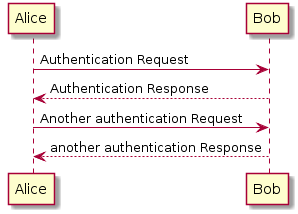
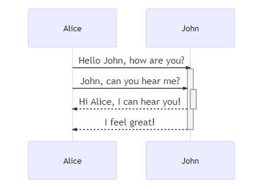

# XX 项目文档范例

[Docsy](https://github.com/google/docsy) 是一个为技术文档网站制作的 Hugo 主题, 
提供了简便的目录导航、结构及其他。

本文档使用一个由何江 (hejiang@tju.edu.cn) 修改的 Docsy 主题。
使用全本地化的 javascript 库, 适合无 internet 访问(或 internet 访问延迟较大)环境部署。

本项目文档示例已发布在 **[https://henry-tech.gitee.io/](https://henry-tech.gitee.io/)**。


## 克隆 XX 项目文档

```bash
git clone --recurse-submodules https://gitee.com/henry-tech/docsy-example.git my-project-docs
```


## 下载 hugo 软件

为了生成静态页面, 需要使用支持 SCSS 编译的 hugo 版本(hugo_extended_*)。

Windows 版本可以从这里下载
https://github.com/gohugoio/hugo/releases/download/v0.59.1/hugo_extended_0.59.1_Windows-64bit.zip


## 文档编写和预览

文档源文件在 content/ 目录下；文件可以是 .html 或 .md 后缀。您可以这样一边编写，一边预览文档：

```bash
cd my-project-docs
hugo server
```

然后您就可以打开浏览器，输入网址 http://localhost:1313/ 查看文档了。


## 产生静态文档网站

```bash
cd my-project-docs
npm install
hugo
```

这里用到了 npm, 它是 nodejs 自带的包管理软件。你需要首先下载并安装 [nodejs](https://nodejs.org)。

生成的静态文档网站在 public/ 目录下。


## 使用 PlantUML 绘制 UML 图

直接在 .md 文件中书写:

    <div class="plantuml">
        @startuml
        Alice -> Bob: Authentication Request
        Bob --> Alice: Authentication Response

        Alice -> Bob: Another authentication Request
        Alice <-- Bob: another authentication Response
        @enduml
    </div>

显示如下:



如果你本地有 plantuml server, 可以把 url 替换为本地  plantuml server 地址:

    <div class="plantuml" url="http://www.plantuml.com/plantuml/img/">
        @startuml
        Alice -> Bob: Authentication Request
        Bob --> Alice: Authentication Response

        Alice -> Bob: Another authentication Request
        Alice <-- Bob: another authentication Response
        @enduml
    </div>

PlantUML 的详细使用方法见 [http://plantuml.com/zh/](http://plantuml.com/zh/)。
也可以参考 [PlantUML_Language_Reference_Guide_zh.pdf](example/PlantUML_Language_Reference_Guide_zh.pdf)。


## 使用 mermaid 绘制 UML 图

直接在 .md 文件中书写:

    <div class="mermaid">
        sequenceDiagram
        Alice->>+John: Hello John, how are you?
        Alice->>+John: John, can you hear me?
        John-->>-Alice: Hi Alice, I can hear you!
        John-->>-Alice: I feel great!
    </div>

显示如下:



mermaid 的详细使用方法见 [https://mermaidjs.github.io/](https://mermaidjs.github.io/)。

由于 qtwebkit 的某些问题(jquery), 
生成的 pdf 中看不到 mermaid 绘制的 UML 图。
推荐使用 PlantUML 绘制各种图形。


## 生成 pdf 文档

假设文档网站在预览状态下(默认 1313 端口)，可以使用 [wkhtmltopdf](https://wkhtmltopdf.org/) 工具生成 pdf 文档:

    wkhtmltopdf --print-media-type --javascript-delay 2000 http://localhost:1313/en/docs/getting-started/ http://localhost:1313/en/docs/getting-started/example-page/ getting-started.pdf

生成的 pdf 效果见 [getting-started.pdf](example/getting-started.pdf)。

为了等待某些 javascript 运行, 可以修改 --javascript-delay 参数设置等待毫秒数。
更多参数设置请参考 [https://wkhtmltopdf.org/docs.html](https://wkhtmltopdf.org/docs.html)。


# Docsy Example

[Docsy](https://github.com/google/docsy) is a Hugo theme for technical documentation sites, providing easy site navigation, structure, and more. This **Docsy Example Project** uses the Docsy theme, as well as providing a skeleton documentation structure for you to use. You can either copy this project and edit it with your own content, or use the theme in your projects like any other [Hugo theme](https://gohugo.io/themes/installing-and-using-themes/).

This Docsy Example Project is hosted at [https://example.docsy.dev/](https://example.docsy.dev/).

You can find detailed theme instructions in the Docsy user guide: https://docsy.dev/docs/

This is not an officially supported Google product. This project is currently maintained.

## Cloning the Docsy Example Project

The following will give you a project that is set up and ready to use (don't forget to use `--recurse-submodules` or you won't pull down some of the code you need to generate a working site). The `hugo server` command builds and serves the site. If you just want to build the site, run `hugo` instead.

```bash
git clone --recurse-submodules --depth 1 https://github.com/google/docsy-example.git
cd docsy-example
hugo server
```

The theme is included as a Git submodule:

```bash
▶ git submodule
 a053131a4ebf6a59e4e8834a42368e248d98c01d themes/docsy (heads/master)
```

If you want to do SCSS edits and want to publish these, you need to install `PostCSS` (not needed for `hugo server`):

```bash
npm install
```

<!--### Cloning the Example from the Theme Project


```bash
git clone --recurse-submodules --depth 1 https://github.com/docsy.git
cd tech-doc-hugo-theme/exampleSite
HUGO_THEMESDIR="../.." hugo server
```


Note that the Hugo Theme Site requires the `exampleSite` to live in a subfolder of the theme itself. To avoid recursive duplication, the example site is added as a Git subtree:

```bash
git subtree add --prefix exampleSite https://github.com/google/docsy.git  master --squash
```

To pull in changes, see `pull-deps.sh` script in the theme.-->

## Running the website locally

Once you've cloned the site repo, from the repo root folder, run:

```
hugo server
```
